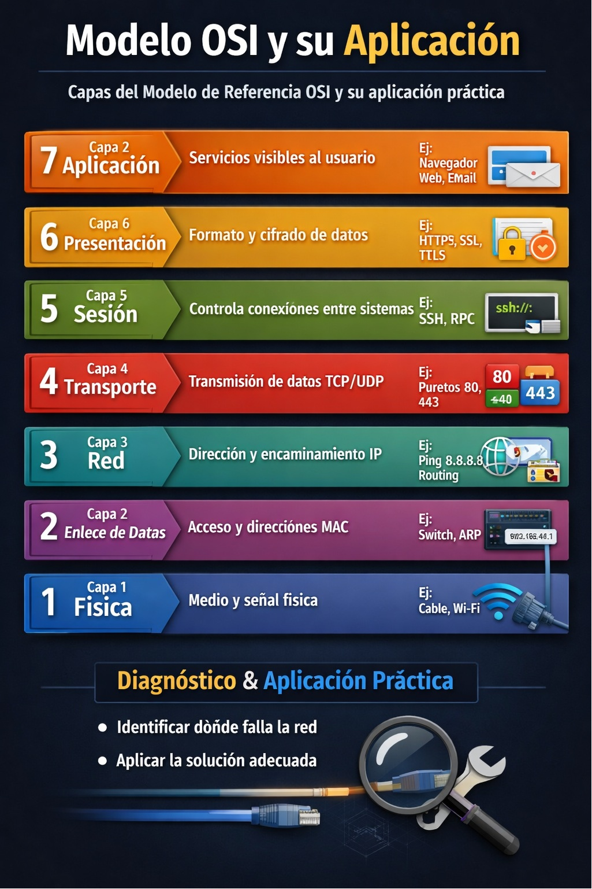

# sistema-OSI-Resolucion
Cómo resolver y documentar el sistema OSI

# 🌐 Sistema OSI – Resolución y Aplicación

## 📌 Descripción
Este laboratorio explica el **modelo OSI** y cómo se aplica en la práctica dentro de entornos de redes y soporte técnico.  
El objetivo es comprender cada capa y relacionarla con ejemplos reales de configuración y diagnóstico.

## 🎯 Objetivos
- [Comprender las 7 capas del modelo OSI](ca://s?q=Explicacion_de_las_7_capas_del_modelo_OSI)
- [Aplicar conceptos en Packet Tracer](ca://s?q=Aplicar_modelo_OSI_en_Packet_Tracer)
- [Relacionar teoría con comandos de red](ca://s?q=Relacionar_modelo_OSI_con_comandos_de_red)
- [Documentar resolución de casos](ca://s?q=Documentar_resolucion_de_casos_en_GitHub)

## 🧩 Capas del modelo OSI con ejemplos
- **Capa Física** → cables, conectores, señal eléctrica.  
- **Capa Enlace de Datos** → switch, MAC address, VLANs.  
- **Capa Red** → IP, routing, `ping`, `traceroute`.  
- **Capa Transporte** → TCP/UDP, puertos.  
- **Capa Sesión** → inicio y cierre de conexiones.  
- **Capa Presentación** → cifrado, compresión.  
- **Capa Aplicación** → servicios como HTTP, DNS, correo.

## 🔧 Aplicación práctica
- Configuración de IP en Linux (`ip addr show`, `netplan apply`).  
- Validación de conectividad (`ping`, `nslookup`).  
- Simulación en Packet Tracer con router, switch y PCs.  
- Documentación de errores y resolución (ejemplo: interfaz desconectada en VM).  

## ✅ Validación
- Ping exitoso entre dispositivos.  
- DNS funcionando con `nslookup`.  
- Comunicación estable en todas las capas del modelo OSI.  

## 📷 Evidencias
- Capturas de Packet Tracer mostrando topología.  
- Resultados de comandos en consola Linux.  
- Diagramas del modelo OSI aplicado al laboratorio.  

## 📚 Notas
Este repositorio forma parte de mi portafolio IT en GitHub, donde documento laboratorios de **Networking, NOC y Administración de Sistemas**.  
El objetivo es mostrar cómo aplico teoría en entornos prácticos y cómo escalo casos de resolución paso a paso.

📌 Cómo resolver y documentar el sistema OSI
La idea es que cada capa tenga:

Definición breve (qué hace).

Ejemplo práctico (comando o herramienta que la valida).

Captura (salida real de tu laboratorio).

Observación (qué significa el resultado).

📊 Ejemplo de documentación por capas
Capa Física

Definición: cables, señal, hardware.

Ejemplo: revisar conexión en VirtualBox (adaptador habilitado).

Observación: si el cable virtual no está conectado, no hay tráfico.

Capa Enlace de Datos

Definición: direcciones MAC, switches.

Ejemplo: ip link show en Linux.

Observación: interfaz activa con MAC válida.

Capa Red

Definición: direccionamiento IP, rutas.

Ejemplo:  ip route show, ping 8.8.8.8.

Observación: si falla, revisar gateway o adaptador.

Capa Transporte

Definición: TCP/UDP, puertos.

Ejemplo: netstat -tulnp o ss -tulnp.

Observación: servicio escuchando en puerto correcto.

Capa Sesión

Definición: control de sesiones entre aplicaciones.

Ejemplo: conexión SSH (ssh usuario@host).

Observación: sesión establecida correctamente.

Capa Presentación

Definición: formato de datos, cifrado.

Ejemplo: HTTPS (certificados válidos).

Observación: datos interpretados correctamente.

Capa Aplicación

Definición: servicios visibles al usuario.

Ejemplo: curl google.com.

Observación: respuesta HTTP válida.

### 📚 Sistema OSI – Documentación práctica

Cada capa se valida con comandos y capturas:

- Física → VirtualBox adaptador habilitado.  
- Enlace → `ip link show`.  
- Red → `ping 8.8.8.8`.  
- Transporte → `netstat -tulnp`.  
- Sesión → conexión SSH.  
- Presentación → HTTPS válido.  
- Aplicación → `curl google.com`.

📌 Observación: Documentar cada capa permite ubicar el fallo en el nivel correcto y aplicar la reparación adecuada.

Agradezco el tiempo de quienes visitan mi portafolio en GitHub. Cada laboratorio refleja mi compromiso con el aprendizaje continuo y la práctica aplicada en IT, redes y administración de sistemas. Mi objetivo es demostrar que puedo diagnosticar, resolver y documentar incidentes de manera profesional, utilizando máquinas virtuales y configuraciones de red.

Invito a reclutadores y colegas a seguir mis repositorios, donde iré compartiendo nuevos proyectos, certificados y logros. Estoy abierto a colaborar y aportar mi experiencia en entornos que valoren la constancia y la capacidad de resolver problemas.

